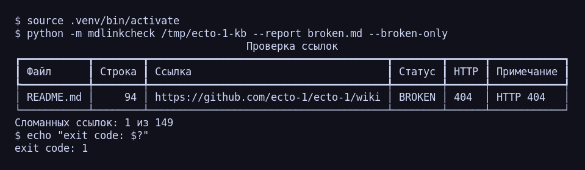

# Результат: mdlinkcheck

CLI-утилита проверки ссылок в Markdown, сгенерированная агентом Claude Code
по [спецификации](SPEC-mdlinkcheck.md) за **один промпт, без единой правки**.

---

## Окружение

| Параметр | Значение |
| --- | --- |
| Модель | **Claude Opus 5**, контекстное окно 1M, план Claude Max |
| Клиент | **Claude Code** v2.1.233 |
| Терминал | **Warp** |
| ОС | Debian 13 (WSL2 на Windows) |
| Язык проекта | Python 3.12 |
| Замер токенов | команда `/usage` в Claude Code: снимок до постановки задачи и сразу после, в одной сессии, без `/clear` |
| Ревью на баги | отдельный агент Claude, проверявший код против спецификации; каждый дефект воспроизведён экспериментально |

---

## Хронология: работа шла в двух сессиях

Это важно для корректного чтения метрик — замерена только первая сессия.

| Этап | Где | Что сделано | Расход токенов |
| --- | --- | --- | --- |
| **1. Генерация** | Claude Code, запущенный в папке проекта | Один промпт — [спецификация](SPEC-mdlinkcheck.md). На выходе: 933 строки, 8 модулей, 31 тест, все зелёные. Уточнений не потребовалось. | **1 765 295, $1.77** — замерено через `/usage` |
| **2. Проверка и упаковка** | Другая сессия Claude Code (в другой папке) | Прогон утилиты на реальном репозитории, ревью кода против спеки → найдено 5 багов, исправление, 6 регрессионных тестов, сборка этой отчётности. | **Не замерялось.** Известен только расход ревью-агента: 75 911 токенов |

**Метрика «общее количество потраченных токенов» относится к этапу 1** — то есть
измеряет ровно то, ради чего ставился эксперимент: во что обходится получение
рабочего кода из одной спецификации.

Расход этапа 2 отдельно не отслеживался: он не является частью замера и по составу
работ (ревью, отладка, документация) с этапом 1 несопоставим. Указываю это явно,
чтобы цифра 1.77 млн не читалась как «полная стоимость проекта».

---

## Метрики задания

| Метрика | Значение |
| --- | --- |
| **Общее количество промптов** | **1** (только спецификация) |
| **Дополнительных промптов** | **0** — уточнения не понадобились |
| **Качество вспомогательных запросов** | Оценивать нечего: их не было |
| **Запустился ли с первого раза** | **Да** — 31 тест зелёный, рабочий прогон без правок |
| **Итоговое количество багов** | **5** (3 major, 2 minor) — найдены ревью, исправлены вторым проходом, см. [BUGS.md](BUGS.md) |
| **Размер спецификации** | ~1200–1800 токенов (оценка; 4403 символа, 120 строк) |
| **Общее количество потраченных токенов** | **1 765 295** (этап генерации; см. хронологию) |
| **Стоимость** | **$1.77** (этап генерации) |
| Модель | Claude Opus 5, контекст 1M |
| Время | 4 мин 9 с (API), 6 мин 28 с (общее) |
| Объём кода | 933 строки добавлено, 8 модулей, 31 тест (после починки — 37) |

---

## Токены: сколько и на что

| Категория | Токенов | Цена | Доля стоимости |
| --- | ---: | ---: | ---: |
| **Input** (новый ввод) | 572 | $0.003 | 0.2% |
| **Output** (сгенерированный код и текст) | 20 800 | $0.52 | 29% |
| **Запись кэша** | 41 500 | $0.42 | 23% |
| **Чтение кэша** | 1 700 000 | $0.85 | 48% |
| **Итого Opus 5** | 1 762 872 | **$1.77** | |
| Haiku 4.5 (служебные вызовы) | 2 423 | $0.003 | |
| **ВСЕГО** | **1 765 295** | **$1.77** | |

Тарифы Opus 5: $5 / млн input, $25 / млн output; кэш — запись ×2, чтение ×0.1.

### Главное про эти цифры

**«Свежих» токенов — всего 65 295.** Это то, что реально обработано по одному разу:
input + output + запись кэша. Остальные **1.7 млн — это повторные чтения кэша**:
на каждом шаге агент перечитывает уже накопленный контекст.

Отсюда неочевидный вывод: **самая дорогая статья — не написанный код, а
перечитывание контекста** (48% стоимости против 29%). Спека короткая, кода немного,
а платишь в основном за то, что модель на каждом шаге заново прогоняет через себя
всё накопленное. Практическое следствие: под новую задачу — новая сессия,
иначе доля переплаты за уже виденный контекст растёт.

При сравнении с чужими замерами это важно: цифра «1.77 млн» и цифра «сколько
обработано впервые» отличаются в 27 раз, и сравнивать нужно сопоставимые величины.

### Расход лимитов

| Лимит | До | После |
| --- | --- | --- |
| Сессия | 12% | 13% (**+1 п.п.**) |
| Неделя (все модели) | 3% | 3% (без изменений) |

---

## Результат работы утилиты

Прогон на реальном репозитории `larchanka-training/ecto-1-kb`:

| Показатель | Значение |
| --- | --- |
| Просканировано `.md` файлов | 56 |
| Проверено ссылок | 149 |
| Найдено сломанных | **1** — `https://github.com/ecto-1/ecto-1/wiki` → HTTP 404 |
| Код возврата | 1 (соответствует спецификации) |

Отчёт утилиты: [broken.md](broken.md) · Полный вывод: [docs/run-full-output.txt](docs/run-full-output.txt)

> Целевой репозиторий приватный. По HTTPS-ссылке утилита повела себя строго по спеке:
> не зависла на запросе пароля (`GIT_TERMINAL_PROMPT=0`) и вернула код 2.
> Для содержательной проверки репозиторий склонирован по SSH и проверен по локальному пути.

---

## Что где лежит

| Файл | Содержимое |
| --- | --- |
| [README.md](README.md) | Документация утилиты: установка, запуск, опции, как устроено |
| **REPORT.md** | Этот файл — результат эксперимента |
| [SPEC-mdlinkcheck.md](SPEC-mdlinkcheck.md) | Спецификация — она же единственный промпт |
| [PROMPTS.md](PROMPTS.md) | Промпты: 1 основной, 0 дополнительных, и почему |
| [BUGS.md](BUGS.md) | 5 найденных багов с воспроизведением |
| [broken.md](broken.md) | Отчёт утилиты по результатам прогона |
| `mdlinkcheck/` | Исходный код, 8 модулей |
| `tests/` | 31 тест + фикстуры |
| `docs/screenshots/` | Скриншот прогона в терминале |

---

## Выводы

1. **Детальная спека окупается.** Ноль уточняющих промптов — прямое следствие трёх
   решений в ТЗ: запрет на вопросы с требованием документировать выбор,
   заранее закрытые сложные места (относительные пути, таймауты) и проверяемый
   критерий готовности (`pytest` в конце).
2. **Одного промпта хватает на рабочий продукт, но не на продакшен.** Основная логика
   реализована корректно — все 5 багов это необработанные краевые случаи
   (битый URL, петля симлинков, нет прав на каталог), а не ошибки в основной логике.
   Характерно, что собственные 31 тест агента их не поймали: он проверял то, что
   спроектировал, а не то, что придёт из чужого репозитория. Исправление заняло
   второй проход — ~20 строк защитных проверок и 6 регрессионных тестов.
3. **Стоимость определяется длиной сессии, а не объёмом кода.** 933 строки стоили
   $0.52 в output, а $0.85 ушло на перечитывание контекста.
4. **«Запустился с первого раза» не равно «багов нет».** Это значит лишь «не упал
   на том входе, который попробовали». Все пять дефектов были латентными: на
   обычных данных утилита работала, стектрейс появлялся только на нестандартном
   вводе. Поэтому цикл «ошибка → исправь по стектрейсу» в первой сессии не
   запустился — падать было не на чем.
